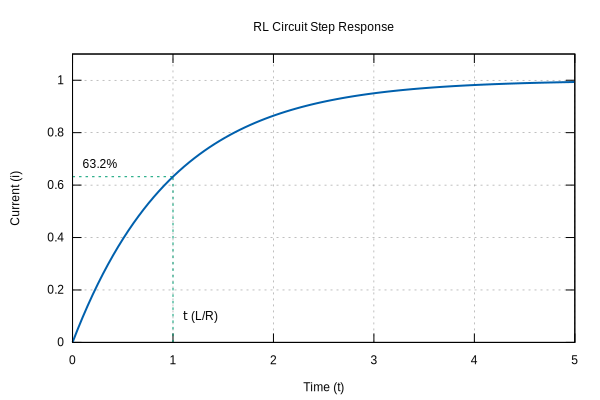

# Resistance and Inductance Estimation

This document describes the theory and implementation details of the motor parameter estimation services in `e-foc`. Specifically, it covers how resistance ($R$) and inductance ($L$) are estimated using a step response method.

## Theory: RL Circuit Step Response

A motor phase can be modeled as a series RL circuit (Resistor + Inductor). When a constant DC voltage step $V$ is applied to such a circuit, the current $i(t)$ rises exponentially towards a steady-state value.

The equation governing the current is:

$$ i(t) = \frac{V}{R} (1 - e^{-\frac{R}{L}t}) $$



Where:
* $V$ is the applied voltage.
* $R$ is the phase resistance.
* $L$ is the phase inductance.
* $t$ is time.
* $\tau = \frac{L}{R}$ is the time constant.

### Resistance Estimation ($R$)
At steady state ($t \to \infty$), the inductor acts as a short circuit, and the current is limit only by the resistance:

$$ I_{steady} = \frac{V}{R} \implies R = \frac{V}{I_{steady}} $$

### Inductance Estimation ($L$)
The time constant $\tau$ is defined as the time it takes for the current to reach $\approx 63.2\%$ of its steady-state value ($1 - e^{-1} \approx 0.6321$).

$$ i(\tau) = I_{steady} \times 0.632 $$

Once $\tau$ is measured, inductance can be calculated:

$$ \tau = \frac{L}{R} \implies L = R \times \tau $$

## Implementation Details

The implementation is located in [source/services/parameter_identification/MotorIdentificationImpl.cpp](../../source/services/parameter_identification/MotorIdentificationImpl.cpp).

### Process

```mermaid
graph TD
    A[Start] --> B[Clear Buffers]
    B --> C[Apply DC Voltage V]
    C --> D{Sampling Loop}
    D -->|Wait SettleTime| E[Filter & Store Samples]
    E --> D
    E -->|Buffer Full| F[Analyze]
    F --> G[Calc Steady State Current Is]
    G --> H[Calc Resistance R = V/Is]
    H --> I[Find time t where i(t) > 0.632*Is]
    I --> J[Calc Inductance L = R*t]
    J --> K[Done]
```

1. **Preparation**: The motor is stopped, and buffers for current samples are cleared.
2. **Voltage Step**: A constant voltage (defined by `measureVoltagePercent` and bus voltage `vdc`) is applied to the D-axis (or simply Phase A alignment).
3. **Sampling**: Phase A current is sampled at a fixed frequency (`samplingFrequency` = 10 kHz).
4. **Filtering**: Samples are passed through a moving average filter to reduce noise.
5. **Steady State Detection**: The algorithm waits for the current buffer to fill and calculates the steady-state current using the last 10% of samples (assuming the system has settled).
6. **Calculation**:
    * **Resistance**: calculated using $R = V_{applied} / I_{steadystate}$.
    * **Time Constant ($\tau$)**: The code searches the recorded samples for the first point where current exceeds $0.632 \times I_{steadystate}$. The index of this sample, adjusted for the filter delay, gives $\tau$.
    * **Inductance**: Calculated as $L = R \times \tau$.

### Code Reference

* `AverageAndRemoveFront`: Implements the moving average filter.
* `GetSteadyStateCurrent`: Averages the last portion of the sample buffer.
* `GetTauFromCurrentSamples`: Finds the time index corresponding to $63.2\%$ of max current.
