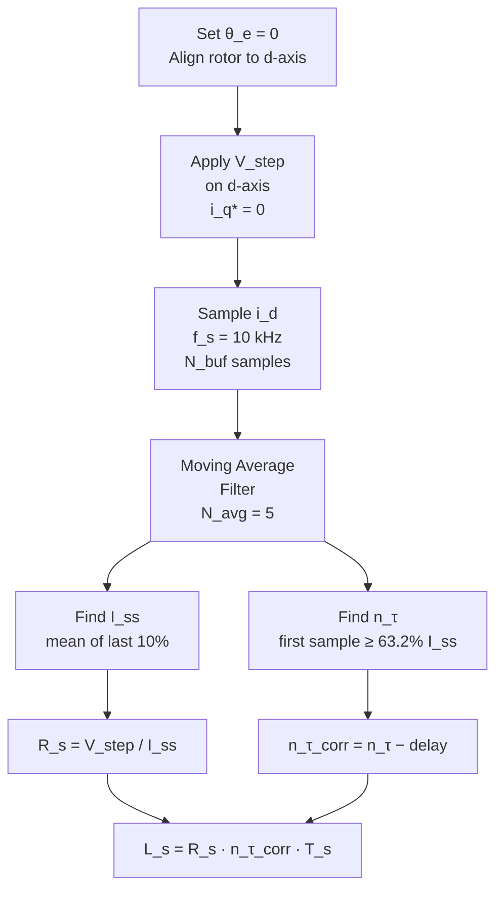

| Field     | Value                                                  |
|-----------|--------------------------------------------------------|
| Title     | Electrical Parameters Identification — R and L         |
| Type      | theory                                                 |
| Status    | approved                                               |
| Version   | 1.0.0                                                  |
| Component | service-electrical-ident                               |
| Date      | 2025-01-01                                             |

## Overview

FOC performance depends directly on accurate stator resistance $R_s$ and inductance $L_s$. These
parameters are used to:
1. Design the PI current controller gains ($K_p = L_s \omega_{bw}$, $K_i = R_s \omega_{bw}$).
2. Implement feed-forward decoupling of the dq cross-coupling terms.
3. Estimate motor temperature from measured $R_s$ (since $R_s \propto T$).

This identification procedure applies a DC voltage step to the motor aligned on the **d-axis** and
measures the current transient. Alignment to the d-axis suppresses the back-EMF (which only appears
on the q-axis), yielding a clean RL circuit step response. Resistance is derived from the DC
steady-state, and inductance from the measured time constant.

---

## Prerequisites

| Symbol         | Meaning                                               | Unit    |
|----------------|-------------------------------------------------------|---------|
| $R_s$          | Stator resistance per phase                           | Ω       |
| $L_s$          | Stator inductance (d-axis, $L_d$)                     | H       |
| $\tau$         | Electrical time constant = $L_s / R_s$               | s       |
| $V_{step}$     | Applied step voltage (d-axis)                         | V       |
| $I_{ss}$       | Steady-state current = $V_{step} / R_s$              | A       |
| $I_\tau$       | Current at time $\tau$: $I_{ss} \cdot (1 - e^{-1})$  | A       |
| $f_s$          | Sampling frequency                                    | Hz      |
| $T_s$          | Sampling period = $1/f_s$                             | s       |
| $N_{avg}$      | Moving average filter length                          | samples |
| $N_{buf}$      | Total sample buffer size                              | samples |

---

## Mathematical Foundation

### 1. d-Axis Alignment and Back-EMF Suppression

Before applying the voltage step, the motor is aligned to $\theta_e = 0$ (rotor d-axis aligned
with stator $\alpha$-axis). In this condition:

- The back-EMF is $e_\alpha = -\psi_f \omega_e \sin(0) = 0$.
- The q-axis current is forced to zero: $i_q = 0$.
- Only the d-axis RL circuit is excited.

The stator d-axis circuit model reduces to:

$$
v_d = R_s\, i_d + L_s \frac{di_d}{dt}
$$

This is a first-order linear system driven by a unit step of amplitude $V_{step}$.

### 2. RL Step Response

For a step input $v_d(t) = V_{step} \cdot u(t)$ with zero initial conditions ($i_d(0) = 0$):

$$
\boxed{i_d(t) = \frac{V_{step}}{R_s}\!\left(1 - e^{-t/\tau}\right)}, \qquad \tau = \frac{L_s}{R_s}
$$

Key properties of this response:
- At $t = \tau$: $i_d(\tau) = I_{ss}(1 - e^{-1}) \approx 0.6321 \cdot I_{ss}$
- At $t = 5\tau$: $i_d(5\tau) \approx 0.9933 \cdot I_{ss}$ (essentially settled)
- Slope at $t = 0$: $\left.\frac{di_d}{dt}\right|_{t=0} = \frac{V_{step}}{L_s}$

See: `documentation/theory/images/rl_step_response.svg` (generated by `documentation/tools/generate_plots.gp`)

### 3. Resistance Estimation

Once the current has fully settled to steady state (after $5\tau$):

$$
\boxed{R_s = \frac{V_{step}}{I_{ss}}}
$$

where $I_{ss}$ is measured from the mean of the last 10% of the sample buffer (to average out noise).

**Noise considerations**: $R_s$ estimation is straightforward but requires:
- Accurate current sensor calibration (ADC offset error directly biases $I_{ss}$).
- Stable $V_{step}$ (DC bus voltage variation during measurement corrupts the result).
- Sufficient settling time in the buffer ($N_{buf} \geq 5\tau / T_s$ samples).

### 4. Inductance Estimation — Time-Constant Method

The time constant $\tau = L_s / R_s$ is found by identifying the sample index $n_\tau$ where the
current first reaches the 63.2% threshold:

$$
i_d[n_\tau] \geq 0.6321 \cdot I_{ss}
$$

The time constant is then:

$$
\tau = n_\tau \cdot T_s
$$

and the inductance:

$$
\boxed{L_s = R_s \cdot \tau = R_s \cdot n_\tau \cdot T_s}
$$

#### Moving Average Filter Correction

A causal moving average filter of length $N_{avg}$ is applied to the raw current samples before
threshold detection:

$$
\bar{i}[n] = \frac{1}{N_{avg}} \sum_{k=0}^{N_{avg}-1} i[n-k]
$$

This FIR filter introduces a lag of $(N_{avg} - 1)/2$ samples. The threshold index is corrected:

$$
n_\tau^{corrected} = n_\tau - \left\lfloor \frac{N_{avg} - 1}{2} \right\rfloor - 1
$$

Without this correction, $\tau$ is overestimated by the filter group delay, leading to an overestimate
of $L_s$.

**Filter trade-off**: larger $N_{avg}$ reduces noise variance $\propto 1/N_{avg}$ but increases the
index correction and requires a corresponding increase in buffer size $N_{buf}$.

### 5. Pole Pair Estimation

The number of electrical cycles per mechanical revolution equals the number of pole pairs $p$.
During the multi-step alignment sweep, the motor is driven through exactly 12 electrical steps over
one full electrical revolution ($2\pi$ electrical). The encoder counts $C_{mech}$ per step multiplied
by $N_{steps} = 12$ gives the total encoder counts per full electrical cycle. Dividing by the known
encoder counts per mechanical revolution $C_{rev}$ gives:

$$
p = \frac{C_{rev}}{12 \cdot C_{per\_step}} \quad \text{(integer, rounded)}
$$

or equivalently, the total electrical angle traversed over the full 12-step sweep spans exactly
$2\pi$ electrical = $2\pi/p$ mechanical, so:

$$
p = \frac{2\pi}{\Delta\theta_{mech,total}}
$$

where $\Delta\theta_{mech,total}$ is the measured total mechanical rotation during the sweep.

### 6. Complete Identification Sequence

```
1. Drive alignment: rotate field through N_steps to θ_e = 0.
   Record encoder offset θ_offset (see alignment theory).

2. Apply step voltage V_step on d-axis (i_q* = 0, v_d = V_step).

3. Sample i_d at f_s = 10 kHz for N_buf samples.

4. Apply moving average filter (length N_avg = 5) to samples.

5. Find steady-state current I_ss from mean of last 10% of buffer.

6. Compute R_s = V_step / I_ss.

7. Find first index n_τ where i_d[n] ≥ 0.6321 · I_ss.

8. Correct for filter delay: n_τ_corr = n_τ − ⌊(N_avg−1)/2⌋ − 1.

9. Compute τ = n_τ_corr · T_s, L_s = R_s · τ [H].
   Express L_s in mH: L_s_mH = R_s · n_τ_corr / f_s · 1000.
```

---

## Block Diagrams

### Electrical Identification Signal Flow


```mermaid
graph TD
    A[Set θ_e = 0\nAlign rotor to d-axis] --> B[Apply V_step\non d-axis\ni_q* = 0]
    B --> C[Sample i_d\nf_s = 10 kHz\nN_buf samples]
    C --> D[Moving Average\nFilter\nN_avg = 5]
    D --> E[Find I_ss\nmean of last 10%]
    D --> F[Find n_τ\nfirst sample ≥ 63.2% I_ss]
    E --> G[R_s = V_step / I_ss]
    F --> H[n_τ_corr = n_τ − delay]
    G --> I[L_s = R_s · n_τ_corr · T_s]
    H --> I
```

### RL Step Response — ASCII Approximation

```
i_d (normalised: I_ss = 1.0)
  │
1.0├───────────────────────────────── I_ss = V/R (steady state)
   │                       ──────────
0.86├──────────────────────/
   │                     /
0.63├────────────────────/ ← i(τ) = 0.632·I_ss
   │                   /
   │                  /
0.39├─────────────────/
   │               /
   │             /
   │           /
0.0├───────────
   └───────────────────────────────── samples (n·T_s)
       0      τ/T_s   2τ/T_s  5τ/T_s
              ↑
          n_τ (63.2% crossing) — filter delay correction applied
```

---

## Numerical Properties

| Property             | Value / Condition                                                 |
|----------------------|-------------------------------------------------------------------|
| Sampling rate        | $f_s = 10\ \text{kHz}$, $T_s = 100\ \mu\text{s}$                |
| Filter length        | $N_{avg} = 5$ samples                                            |
| Filter group delay   | $(N_{avg}-1)/2 = 2$ samples = $200\ \mu\text{s}$                |
| Threshold            | $0.6321 \cdot I_{ss}$ (i.e. $1 - e^{-1}$)                       |
| $R_s$ range          | Nominally $0.1\ \Omega$ to $50\ \Omega$ (ADC current range)     |
| $L_s$ resolution     | $R_s \cdot T_s$ (one sample step) = depends on $R_s$            |
| $L_s$ min detectable | Approx. $R_s \cdot 2 T_s$ (due to filter delay correction)      |
| Trigger voltage      | $V_{step}$ must be small enough to avoid magnetic saturation     |

### Sensitivity Analysis

| Source of Error          | Effect on $R_s$           | Effect on $L_s$                  |
|--------------------------|--------------------------|----------------------------------|
| ADC current offset       | Directly biases $I_{ss}$ | Indirect via $R_s$ error         |
| $V_{dc}$ variation       | Biases $V_{step}$        | Indirect via $R_s$ error         |
| Thermal drift in $R_s$   | Measurement valid at $T_{meas}$ only | — |
| Filter delay not corrected | —                      | $L_s$ overestimated by $N_{avg}/2$ steps |
| Insufficient buffer      | $I_{ss}$ underestimated  | $\tau$ underestimated            |
| Magnetic saturation      | $R_s$ underestimated     | $L_s$ underestimated (nonlinear) |

---

## Worked Example

Motor: $V_{step} = 2\ \text{V}$, $R_s = 1.2\ \Omega$, $L_s = 0.6\ \text{mH}$,
$f_s = 10\ \text{kHz}$, $N_{avg} = 5$.

**Expected results:**

$$I_{ss} = \frac{2}{1.2} \approx 1.667\ \text{A}$$

$$\tau = \frac{L_s}{R_s} = \frac{0.6 \times 10^{-3}}{1.2} = 0.5\ \text{ms} = 5\ T_s$$

At the 63.2% threshold: $i_d[n_\tau] \geq 0.6321 \times 1.667 = 1.054\ \text{A}$

The raw crossing occurs at $n_\tau = 5$. Filter delay correction: $n_\tau^{corr} = 5 - 2 - 1 = 2$.

$$L_s = 1.2 \times 2 \times 100 \times 10^{-6} \times 1000 = 0.24\ \text{mH}$$

> The example shows that a very short $\tau$ (5 samples) combined with a 5-tap filter and a
> 2-sample delay correction can yield significant estimation error. In practice $\tau$ should be
> at least 15–20 samples for accurate identification.

---

## Limitations & Assumptions

- **Assumes**: The rotor is aligned to the d-axis ($\theta_e = 0$, $\dot\theta = 0$). Any rotor
  motion during identification overlays a back-EMF on the d-axis current.
- **Assumes**: $L_d \approx L_q$ (surface-mounted PMSM). For interior PMSM, the step must be
  repeated on both axes if the design requires both $L_d$ and $L_q$.
- **Assumes**: Magnetic linearity (no saturation). The identification current $I_d^{step}$ must
  be kept below the saturation current.
- **Does not handle**: Temperature-dependent $R_s$ variation during operation.
- **Does not handle**: Identification at running speed where back-EMF cannot be zeroed by alignment alone.

## References

1. Rauf, A. et al. — "Online Identification of PMSM Parameters Based on Extended Kalman Filter",
   *IEEE Transactions on Industrial Electronics*, 2019.
2. Underwood, S.J. & Husain, I. — "Online Parameter Estimation and Adaptive Control of PMSM",
   *IEEE Transactions on Industrial Electronics*, 2010.
3. Texas Instruments Application Report SPRABV5 — *Motor Control in Embedded Applications*, 2018.
