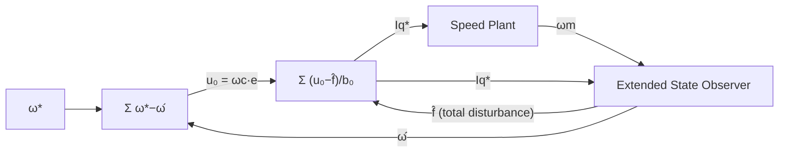

| Field     | Value               |
|-----------|---------------------|
| Title     | Speed Loop — S2: ADRC |
| Type      | theory              |
| Status    | draft               |
| Version   | 1.0.0               |
| Component | speed-loop-adrc     |
| Date      | 2026-08-31          |

> **Theory document**: Explains the mathematical and engineering principles behind a component or algorithm.
> This document is descriptive — it records the *why* and *how* at a scientific level, independent of any
> specific implementation. Equations use KaTeX ($inline$ and $$block$$). Block diagrams use Mermaid or
> ASCII art.

---

## Overview

S2 (Active Disturbance Rejection Control) makes the load torque disturbance explicit: an Extended
State Observer (ESO) estimates the total disturbance (load torque + model error) in real time and
the control law cancels it. This gives dramatically faster load-step rejection than integral action
alone, with only two tuning parameters ($\omega_c$, $\omega_o$). LQI handles the disturbance only
implicitly through its integral state; ADRC cancels it before the control law sees it.

Operates exclusively in the **1 kHz outer handler**. Requires $K_t$ and $J$ from mechanical RLS.

---

## Prerequisites

| Symbol             | Meaning                          | Unit  |
|--------------------|----------------------------------|-------|
| $A_d^o, B_d^o$     | Discrete speed plant matrices    | —     |
| $\hat{x}, \hat{f}$ | Observer state estimates         | —     |
| $\omega_o$         | ESO bandwidth                    | rad/s |
| $\omega_c$         | Control bandwidth                | rad/s |
| $b_0$              | ADRC plant gain $= K_t/J$        | —     |

See `documentation/theory/foc-plant-models.md` §2 for the speed plant derivation.

---

## Mathematical Foundation

All speed controllers operate on the **discrete mechanical speed plant** from
`documentation/theory/foc-plant-models.md` §2:

$$
\omega_m[k+1] = A_d^o \cdot \omega_m[k] + B_d^o \cdot u[k]
$$

The unknown load torque $T_L/J$ enters as a state perturbation. S2 estimates it in real time with
an Extended State Observer and cancels it before the control law sees it.

---

## S2 — Active Disturbance Rejection Speed Control (ADRC)

**Extended plant**: Lump total disturbance $f$ (absorbing both $T_L$ and model error) into the state:

$$
\frac{d\omega_m}{dt} = b_0\, u + f, \qquad b_0 = \frac{K_t}{J}
$$

**ESO** (second-order, bandwidth $\omega_o$, binomial gain placement):

$$
L = [\beta_1,\; \beta_2]^T, \quad \beta_1 = 2\omega_o,\quad \beta_2 = \omega_o^2
$$

Discrete update at $T_s^o$:

$$
e_{obs}[k] = \omega_m[k] - \hat{\omega}_m[k]
$$
$$
\hat{\omega}_m[k+1] = \hat{\omega}_m[k] + T_s^o\,(\beta_1 e_{obs}[k] + \hat{f}[k] + b_0 u[k])
$$
$$
\hat{f}[k+1] = \hat{f}[k] + T_s^o \cdot \beta_2 e_{obs}[k]
$$

**Control law**:

$$
u_0[k] = \omega_c\,(\omega_m^*[k] - \hat{\omega}_m[k])
$$
$$
\boxed{u[k] = \frac{u_0[k] - \hat{f}[k]}{b_0}}
$$

**Tuning (two parameters)**:
- $\omega_c$: desired closed-loop speed bandwidth (rad/s). Sets command-tracking rise time.
- $\omega_o$: ESO bandwidth. Rule of thumb: $\omega_o = 3$–$10 \times \omega_c$.
- $b_0 = K_t/J$ from RLS. Tolerates ±50% error without stability loss.

**Performance**: Under a step load torque, the ADRC suppresses the speed dip in approximately
$1/\omega_o$ seconds — typically an order of magnitude faster than integral action alone.

**Relation to toolbox**: `ActiveDisturbanceRejectionControl<float,1>` implements this ESO and
control law — the template parameter is the plant order, and the extended state carrying $\hat{f}$ is
added on top of it. `Compute(ω_ref, ω_meas)` is called once per 1 kHz handler cycle.

---

## Numerical Properties

| Property                   | Value                                          |
|----------------------------|------------------------------------------------|
| Ops per 1 kHz cycle        | 6 MACs (ESO update + control law)              |
| Steady-state speed error   | Zero (ESO cancels constant disturbances)       |
| Load disturbance rejection | Explicit cancellation — ~$1/\omega_o$ response |
| Tracking vs. stiffness     | Coupled (single DOF)                           |
| Requires mechanical RLS    | Yes ($K_t$, $J$)                               |
| Tuning knobs               | 2 ($\omega_c$, $\omega_o$)                     |

---

## Limitations & Assumptions

- Treats the current loop as ideal ($i_q \approx i_q^*$). Valid when current-loop bandwidth is at
  least 10× the speed-loop bandwidth.
- ESO estimates $\hat{f}$ with a lag proportional to $1/\omega_o$. Disturbances faster than $\omega_o$
  are not fully cancelled.
- High $\omega_o$ amplifies speed measurement noise. Use a velocity smoother upstream if needed.
- The ESO is discretized with forward Euler, whose poles leave the unit circle for
  $\omega_o T_s^o > 0.83$. The toolbox enforces the conservative precondition
  $\omega_o T_s^o < 0.5/n$; the configured observer bandwidth is clamped to $\omega_o \leq 0.4 / T_s^o$
  to stay inside it, which caps the usable $\omega_o/\omega_c$ ratio at 1 kHz.
- The clipped $i_q^*$ is fed back into the ESO each cycle, so a sustained current clip does not
  bias $\hat{f}$.
- Speed estimate must be smooth. A noisy encoder derivative degrades all speed controllers equally.

---

## References

1. Krishnan, R. — *Permanent Magnet Synchronous and Brushless DC Motor Drives*, CRC Press, 2010.
2. Han, J. — "From PID to Active Disturbance Rejection Control", *IEEE Trans. Ind. Electron.*,
   56(3):900–906, 2009.
3. Gao, Z. — "Scaling and Bandwidth-Parameterization Based Controller Tuning", *Proc. ACC*, 2003.
