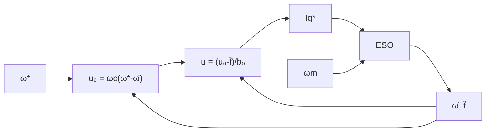

| Field     | Value                   |
|-----------|-------------------------|
| Title     | Speed Loop Controllers  |
| Type      | theory                  |
| Status    | draft                   |
| Version   | 0.1.0                   |
| Component | speed-loop-controllers  |
| Date      | 2026-08-10              |

> **Theory document**: Explains the mathematical and engineering principles behind a component or algorithm.
> This document is descriptive — it records the *why* and *how* at a scientific level, independent of any
> specific implementation. Equations use KaTeX ($inline$ and $$block$$). Block diagrams use Mermaid or
> ASCII art.

---

## Overview

This document covers the three advanced speed-loop controller algorithms that replace or augment
the standard PI speed regulator. All three operate exclusively in the **1 kHz low-priority handler**
(outer loop). They are not valid for the current or position loops.

**Plant model prerequisite**: All controllers operate on the discrete mechanical speed plant derived
in `documentation/theory/foc-plant-models.md` Section 2:

$$
\omega_m[k+1] = A_d^o \cdot \omega_m[k] + B_d^o \cdot u[k]
$$

with $A_d^o \approx 1 - B_f T_s^o / J$ and $B_d^o = K_t T_s^o / J$. The control input $u$ is the
$i_q^*$ reference passed to the current loop.

| Algorithm | Key Advantage |
|-----------|---------------|
| S1 — LQI state-feedback | Optimal gains computed directly from RLS estimates; systematic tuning |
| S2 — ADRC | Explicit disturbance cancellation; fastest load-step rejection; 2 tuning knobs |
| S3 — Two-DOF | Decoupled command tracking and load stiffness tuning |

---

## Prerequisites

| Symbol | Meaning | Unit |
|--------|---------|------|
| $A_d^o, B_d^o$ | Discrete speed plant matrices | — |
| $Q, R$ | LQR weighting matrices | — |
| $P$ | DARE solution (optimal cost-to-go) | — |
| $\hat{x}, \hat{f}$ | Observer state estimates | — |
| $\omega_o$ | ESO bandwidth | rad/s |
| $\omega_c$ | Control bandwidth | rad/s |
| $b_0$ | ADRC plant gain $= K_t/J$ | — |
| $\tau_{ff}$ | Two-DOF pre-filter time constant | s |

See `documentation/theory/foc-plant-models.md` for all base symbols.

---

## Mathematical Foundation

All three algorithms operate on the **discrete mechanical speed plant** from
`documentation/theory/foc-plant-models.md` Section 2. Treating the current loop as ideal
($i_q \approx i_q^*$), the speed dynamics under control input $u = i_q^*$ are:

$$
\omega_m[k+1] = A_d^o \cdot \omega_m[k] + B_d^o \cdot u[k], \quad
A_d^o \approx 1 - \frac{B_f T_s^o}{J},\quad B_d^o = \frac{K_t T_s^o}{J}
$$

The unknown load torque $T_L/J$ enters as a state perturbation. S1 (LQI) addresses it via an
integral augmentation state. S2 (ADRC) estimates it in real time with an Extended State Observer
and cancels it before the control law sees it. S3 (Two-DOF) separates its rejection from the
command-tracking design using a reference pre-filter.

---

## S1 — LQI Speed Control

**Motivation**: A PI speed controller is heuristically tuned and its gains have no direct physical
meaning. LQI (Linear-Quadratic-Integral) state-feedback computes gains that minimise an explicit
cost function directly from the mechanical RLS estimates $\hat{J}$ and $\hat{B}_f$. The integral
augmentation guarantees zero steady-state error to a constant speed reference.

**Integral augmentation**: Augment the discrete speed plant with an integrator state $x_I$ that
accumulates the speed error:

$$
x_I[k+1] = x_I[k] + (\omega_m^*[k] - \omega_m[k])
$$

The augmented plant matrices:

$$
\mathbf{A}_{aug} = \begin{pmatrix} A_d^o & 0 \\ -1 & 1 \end{pmatrix},
\qquad
\mathbf{B}_{aug} = \begin{pmatrix} B_d^o \\ 0 \end{pmatrix}
$$

**Gain design via DARE**:

$$
P = A_{aug}^T P A_{aug} - A_{aug}^T P B_{aug}(R + B_{aug}^T P B_{aug})^{-1} B_{aug}^T P A_{aug} + Q
$$

$$
\mathbf{K} = [K_\omega,\; K_I] = (R + B_{aug}^T P B_{aug})^{-1} B_{aug}^T P A_{aug}
$$

**Control law** (run-time: two multiplications and one addition):

$$
u[k] = -K_\omega\,(\omega_m[k] - \omega_m^*[k]) + K_I\, x_I[k]
$$

Structurally identical to a discrete PI but with gains derived from physical parameters and an
explicit performance cost.

**Tuning** ($Q = \mathrm{diag}(q_\omega, q_I)$, scalar $R$):
- $q_\omega$: speed error penalty — tighter tracking, higher control effort.
- $q_I$: integral state penalty — faster integrator wind-down, less overshoot.
- $R$: input penalty — directly caps the $i_q^*$ command.
- Starting point: $q_\omega = 1$, $q_I = 0.1$, $R = 1/I_{q,max}^2$.

**Gain computation** runs once at configuration time off the hot path using the `DARE` solver from
the numerical toolbox. The 1 kHz handler executes only the dot product.

---

## S2 — Active Disturbance Rejection Speed Control (ADRC)

**Motivation**: The load torque $T_L$ is an unknown disturbance that LQI handles only implicitly
through the integral state. ADRC makes this explicit: an Extended State Observer (ESO) estimates the
total disturbance (load torque + model error) in real time and the control law cancels it. This gives
dramatically faster load-step rejection than integral action, with only two tuning parameters.

**Extended plant**: Lump total disturbance $f$ (absorbing both $T_L$ and model error) into the state:

$$
\frac{d\omega_m}{dt} = b_0\, u + f, \qquad b_0 = \frac{K_t}{J}
$$

**ESO** (second-order, bandwidth $\omega_o$, binomial gain placement):

$$
L = [\beta_1,\; \beta_2]^T, \quad \beta_1 = 2\omega_o,\quad \beta_2 = \omega_o^2
$$

Discrete update at $T_s^o$:

$$
e_{obs}[k] = \omega_m[k] - \hat{\omega}_m[k]
$$
$$
\hat{\omega}_m[k+1] = \hat{\omega}_m[k] + T_s^o\,(\beta_1 e_{obs}[k] + \hat{f}[k] + b_0 u[k])
$$
$$
\hat{f}[k+1] = \hat{f}[k] + T_s^o \cdot \beta_2 e_{obs}[k]
$$

**Control law**:

$$
u_0[k] = \omega_c\,(\omega_m^*[k] - \hat{\omega}_m[k])
$$
$$
\boxed{u[k] = \frac{u_0[k] - \hat{f}[k]}{b_0}}
$$

**Tuning (two parameters)**:
- $\omega_c$: desired closed-loop speed bandwidth (rad/s). Sets command-tracking rise time.
- $\omega_o$: ESO bandwidth. Rule of thumb: $\omega_o = 3$–$10 \times \omega_c$.
- $b_0 = K_t/J$ from RLS. Tolerates ±50% error without stability loss.

**Performance**: Under a step load torque, the ADRC suppresses the speed dip in approximately
$1/\omega_o$ seconds — typically an order of magnitude faster than integral action alone.

**Relation to toolbox**: `ActiveDisturbanceRejectionControl<float,2>` implements this ESO and
control law. `Compute(ω_ref, ω_meas)` is called once per 1 kHz handler cycle.

<!-- tikz:diagrams/speed-loop-adrc.tex -->

<!-- /tikz -->

---

## S3 — Two-DOF Speed Control

**Motivation**: A single-DOF controller (PID, LQI, ADRC) cannot independently shape command tracking
and disturbance rejection. Tightening the feedback for faster setpoint following degrades load
stiffness and vice versa. The Two-DOF structure adds a reference pre-filter $F(z)$ in the forward
path that shapes tracking independently from the feedback loop designed for disturbance stiffness.
This is particularly valuable for servo speed control where both are required simultaneously.

**Structure**: The PI feedback controller receives a pre-filtered setpoint:

$$
e_{fb}[k] = F(z)\,\omega_m^*[k] - \omega_m[k]
$$

The pre-filter is a first-order low-pass parameterised by $\tau_{ff}$:

$$
F(z) = \frac{1 - e^{-T_s^o/\tau_{ff}}}{z - e^{-T_s^o/\tau_{ff}}}
$$

**Decoupled transfer functions**:

$$
T_{track}(z) = F(z)\,C_{fb}(z)\,G(z)\,(1 + C_{fb}(z)\,G(z))^{-1}
$$
$$
T_{dist}(z) = G(z)\,(1 + C_{fb}(z)\,G(z))^{-1}
$$

$\tau_{ff}$ shapes tracking speed; PI gains shape disturbance rejection. Neither constrains the other.

**Relation to toolbox**: `Feedforward2Dof` implements this structure directly.

**Tuning**:
- PI gains ($K_p$, $K_i$): design for disturbance rejection bandwidth $\omega_{bw}$ as in standard PI.
- $\tau_{ff}$: set $\leq 1/\omega_{bw}$ for tracking at least as fast as the feedback loop. Set larger
  to deliberately smooth abrupt setpoint changes.

---

## Numerical Properties

| Property | PID (baseline) | LQI (S1) | ADRC (S2) | Two-DOF (S3) |
|----------|:--------------:|:--------:|:---------:|:------------:|
| Ops per 1 kHz cycle | ~6 MACs | 2 MACs | 6 MACs | ~8 MACs |
| Steady-state error | Zero (I) | Zero (I) | Zero (ESO) | Zero (I) |
| Load disturbance rejection | PI quality | PI quality | Explicit cancellation | PI quality |
| Tracking vs. stiffness | Coupled | Coupled | Coupled | Decoupled |
| Tuning knobs | 3 (Kp, Ki, Kd) | 3 (qω, qI, R) | 2 (ωo, ωc) | 3 (Kp, Ki, τff) |
| Requires mechanical RLS | No | Yes (J, Bf) | Yes (Kt, J) | No |

### DARE Timing

DARE solved once at configuration time. For the 2×2 augmented speed system: under 2 µs at 120 MHz.
Negligible relative to Enable/Disable latency.

---

## Limitations & Assumptions

**All speed controllers**:
- Treat the current loop as ideal ($i_q \approx i_q^*$). Valid when current-loop bandwidth is at
  least 10× the speed-loop bandwidth.
- Speed estimate must be smooth enough for the feedback controller. A noisy encoder derivative will
  degrade all three controllers equally; an alpha-beta filter or Kalman smoother is recommended.

**S1 — LQI**:
- Integral wind-up: the integral state $x_I$ must be clamped when $i_q^*$ saturates. Anti-windup is
  required.
- DARE conditioning: if $B_d^o = K_t T_s^o / J \approx 0$ (extremely large inertia), the DARE may
  be ill-conditioned. Verify the controllability Gramian before solving.

**S2 — ADRC**:
- ESO estimates $\hat{f}$ with a lag proportional to $1/\omega_o$. Disturbances faster than $\omega_o$
  are not fully cancelled.
- High $\omega_o$ amplifies speed measurement noise. Use a velocity smoother upstream if needed.

**S3 — Two-DOF**:
- $\tau_{ff}$ must be smaller than the closed-loop mechanical time constant to avoid pre-filter lag
  causing overshoot.
- If the incoming speed reference is already smooth, $\tau_{ff}$ can equal the PI time constant,
  which degenerates the Two-DOF to a standard PI.

---

## References

1. Krishnan, R. — *Permanent Magnet Synchronous and Brushless DC Motor Drives*, CRC Press, 2010.
2. Åström, K.J. & Wittenmark, B. — *Computer-Controlled Systems*, 3rd ed., Prentice Hall, 1997.
3. Han, J. — "From PID to Active Disturbance Rejection Control", *IEEE Trans. Ind. Electron.*,
   56(3):900–906, 2009.
4. Gao, Z. — "Scaling and Bandwidth-Parameterization Based Controller Tuning", *Proc. ACC*, 2003.
5. Åström, K.J. & Hägglund, T. — *Advanced PID Control*, ISA, 2006.
   (Two-DOF PID structure, reference pre-filter design.)
